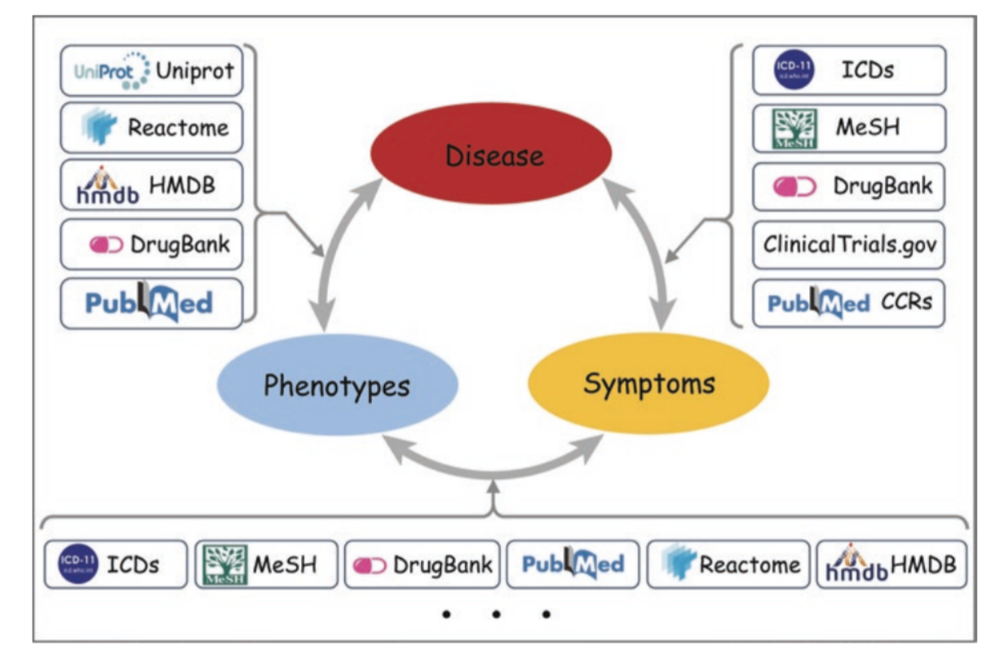

### Title: 
***Mapping MeSH (ICD codes) to molecular mechanism through protein-protein co-occurance graph -toward high precission medicine***

### Detail:

One of the central idea in personalized medicine is to understanding the disease and symptoms in terms of molecular phenotypes. Bridging molecular phenotypes to disease signs and symptoms is a challenging task. The bigest question is building the personal interactome through the interface of personal omics and past history of medical records (e.g., EHR, EMR). In this project, our attempt will be to create a mapping of Medical Subjet Heading (MeSH/ICD) to relevant protein-protein co-occurance graph. Since MeSH terms are organized in hierarchical tree structure, we are only considering the leaf nodes of the cardiovascular tree.  With protein-protein co-occurance graph, one can extend it to relevant genes, metabolites and molecular pathways. 

Figure: Sigdel et. al., Understanding the Molecular Interface of 
Cardiovascular Diseases and COVID-19:A Data Science Approach, 
Advanced Technologies in Cardiovascular Bioengineering, 2022

### Data Sources

1. [PubMed API](https://www.ncbi.nlm.nih.gov/home/develop/api/)
2. [MeSH Trees](https://www.nlm.nih.gov/mesh/meshhome.html)

### Project Walkthrough

1. Prepare Cardiovascular Documents from PubMed
2. Get MeSH terms (MeSH tree 20222) from NLM library 
3. Build MeSH to PMID and PMID to MeSH mapping through caseOLAP platform
4. Build document to entity mapping (PMID to protein mapping) through caseOLAP platform
5. Create MeSH to entities mapping for leaf nodes of the CVD meSH tree.
6. Create protein-protein co-occurance graph by utilizing document to entity mapping
7. Integrate protein-protein co-ocurrance graph with MeSH, Pathways, Drugs, Metabolites information.
8. Load graph data in Neo4J platform for further exploration

### Educational Goal:
This project offers the opportunity of learning about disease terminologies (MeSH/ICD codes) as tree data structure. These data structure play key role in organizing documents in databases (e.g., MeSH in PubMed, ICD codes in EHR database). Implementing text-mining and knowledggraph for targeted disese/symptoms to molecular mechanism is central construct of creating a interface of personl EHR data and scientific research. The take home skills in this projects are text-mining, data engineering with graph data, and AI algorithms.

### Scientific Goal:
Implementation of text-mining for building mapping of MeSH (ICD codes) to molecular mechanism through protein-protein co-occurance graph provides the new insight toward the high precission medicine. In case of medical informatics, this approach will help in building automated cohort selection and patients classification. It will be helpful in creating personalized interface of clinical and biomedical information.

### References: 
1. [International Classification of Diseases (ICD)](https://www.who.int/standards/classifications/classification-of-diseases)
2. [Reactome](https://reactome.org)
3. [Drug Bank](https://www.drugbank.com)
4. [HMDB](https://hmdb.ca)
5. [Graph Academy](https://neo4j.com/graphacademy/)
6. [Graph Data Science Library -GDS](https://neo4j.com/docs/graph-data-science/current/algorithms/)

